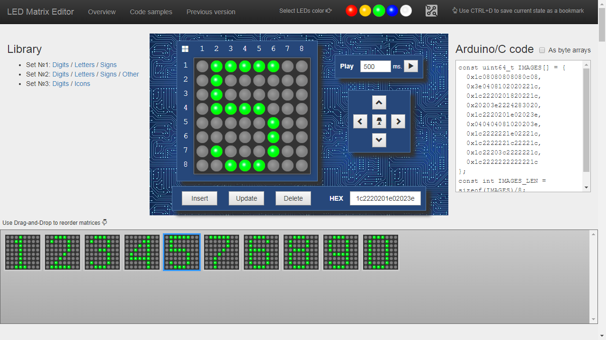
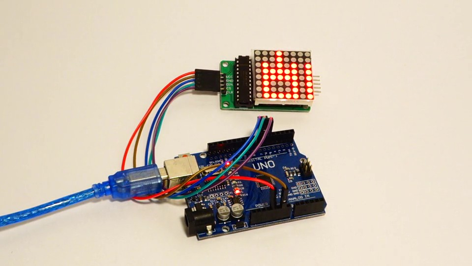
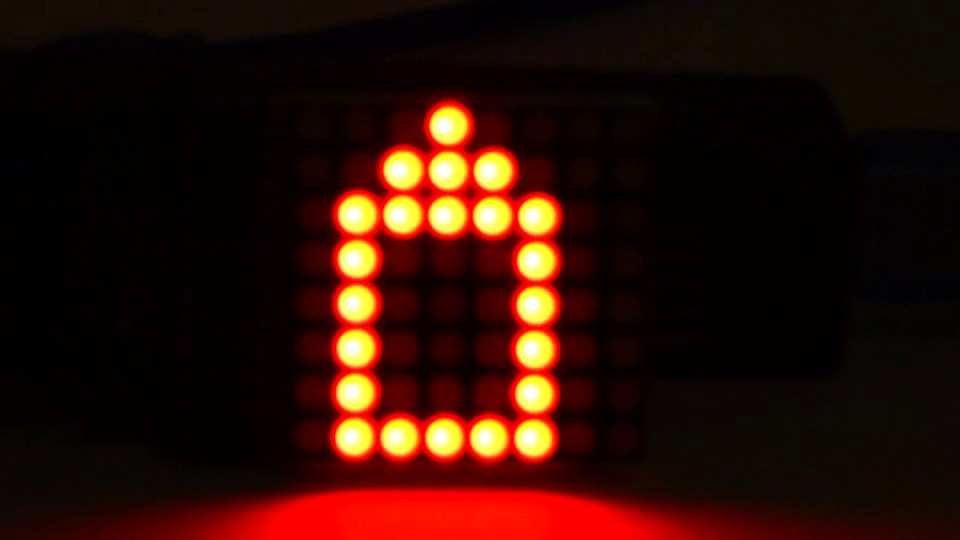
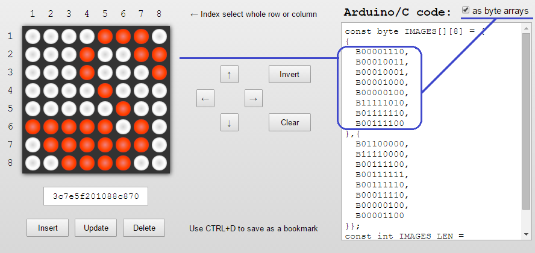

# led-matrix-editor
LED matrix 8x8 online editor

[LED Matrix Editor](http://xantorohara.github.io/led-matrix-editor) - 
is online tool for editing and creating animations for LED matrices.



It looks very simple, but it has some handy features:

- Online, free and safe. No additional software required.
- Toggle LEDs using a mouse
- Toggle a whole row or column by clicking the appropriate matrix's index
- Shift the matrix Up, Down, Left or Right via the single click
- Invert or Clear matrix
- Collect matrices in the bottom pane and then reorder them using the Drag-and-Drop
- Update images as well as insert new or delete existing
- Save images as a C code for Arduino
- Choose type of generated code (64-bit integers or arrays of bytes)
- Predefined fonts 8x8
- Use browsing history and save images as a link or bookmark, so you never lost your creations

I hope you will be fun and happy using it.

And this is the sample how to use generated code in the Arduino project:

```C
const int DIN_PIN = 7;
const int CS_PIN = 6;
const int CLK_PIN = 5;

const uint64_t IMAGES[] = {
  0x3e2222223e3e0808, 0x3e22223e3e2a0808, 0x3e223e3e2a2a0808, 0xbe3e3e2a2a2a0808,
  0xbe223e3e2a2a0808, 0xbe22223e3e2a0808, 0xbe2222223e3e0808, 0xbe22223e3e2a0808,
  0xbe223e3e2a2a0808, 0xbebe3e2a2a2a0808, 0xbea23e3e2a2a0808, 0xbea2223e3e2a0808,
  0xbea222223e3e0808, 0xbea2223e3e2a0808, 0xbea23e3e2a2a0808, 0xbebebe2a2a2a0808,
  0xbea2be3e2a2a0808, 0xbea2a23e3e2a0808, 0xbea2a2223e3e0808, 0xbea2a23e3e2a0808,
  0xbea2be3e2a2a0808, 0xbebebeaa2a2a0808, 0xbea2bebe2a2a0808, 0xbea2a2be3e2a0808,
  0xbea2a2a23e3e0808, 0xbea2a2be3e2a0808, 0xbea2bebe2a2a0808, 0xbebebeaaaa2a0808,
  0xbea2bebeaa2a0808, 0xbea2a2bebe2a0808, 0xbea2a2a2be3e0808, 0xbea2a2bebe2a0808,
  0xbea2bebeaa2a0808, 0xbebebeaaaaaa0808, 0xbea2bebeaaaa0808, 0xbea2a2bebeaa0808,
  0xbea2a2a2bebe0808, 0xbea2a2a2a2be1c08, 0xbea2a2a2a2a21c1c, 0xbea2a2a2a222001c,
  0xbea2a2a22222001c, 0xbea2a2222222001c, 0xbea222222222001c, 0xbe2222222222001c,
  0x3e2222222222001c, 0x3e2222222222001c, 0x3e22222222221c1c, 0x3e222222223e1c08
};
const int IMAGES_LEN = sizeof(IMAGES) / sizeof(uint64_t);

LedControl display = LedControl(DIN_PIN, CLK_PIN, CS_PIN);


void setup() {
  display.clearDisplay(0);
  display.shutdown(0, false);
  display.setIntensity(0, 10);
}

void displayImage(uint64_t image) {
  for (int i = 0; i < 8; i++) {
    byte row = (image >> i * 8) & 0xFF;
    for (int j = 0; j < 8; j++) {
      display.setLed(0, i, j, bitRead(row, j));
    }
  }
}

int i = 0;

void loop() {
  displayImage(IMAGES[i]);
  if (++i >= IMAGES_LEN ) {
    i = 0;
  }
  delay(100);
}
```

Connect components:




See how it works and enjoy:

[](resources/MAH02147_960x540.mp4)

You may choose how to store images - as long integers or as byte arrays:



There are a lot LED matrix modules you can buy here:

[](http://s.click.aliexpress.com/e/JUrN7eM)
